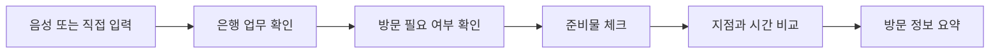
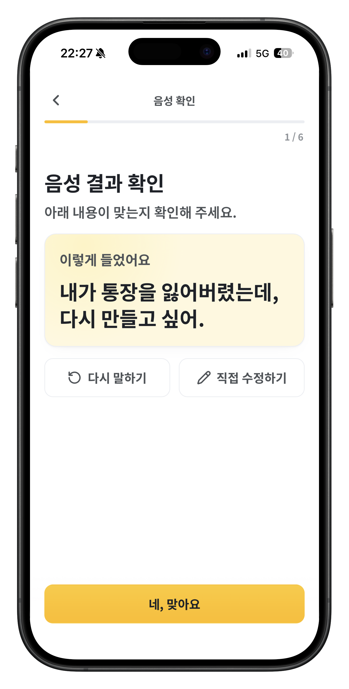
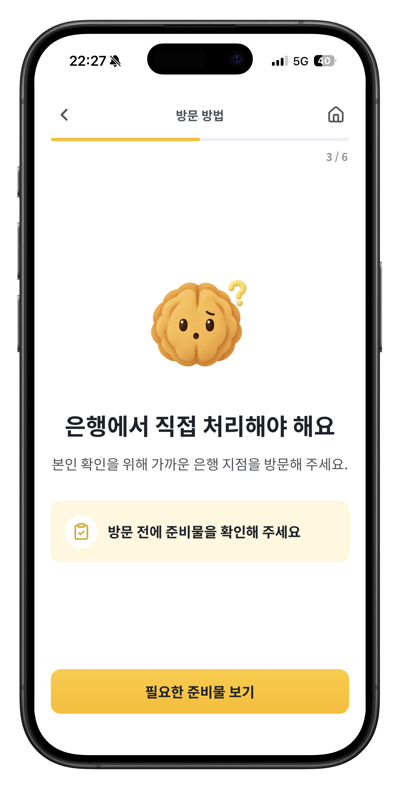
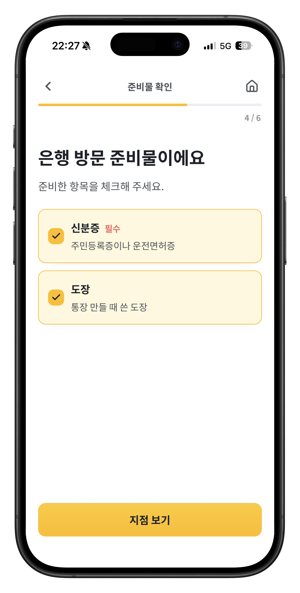
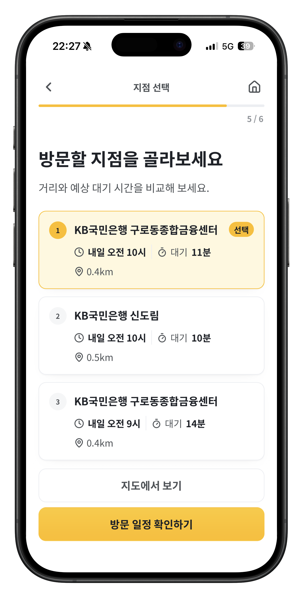
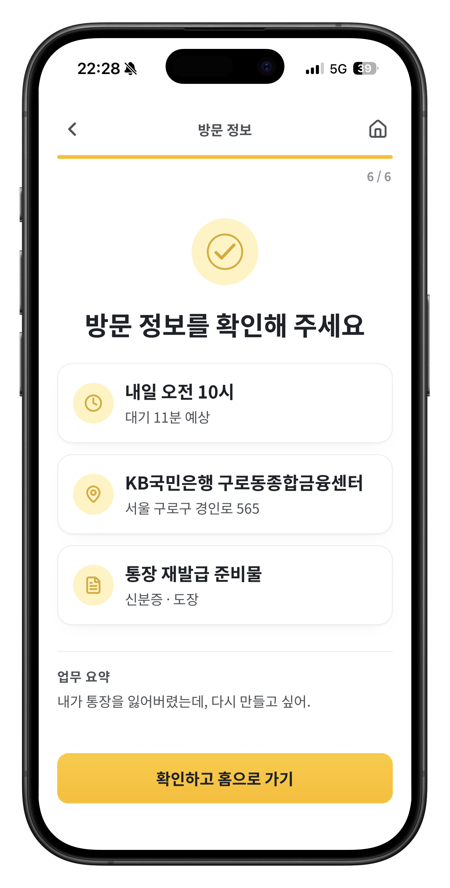
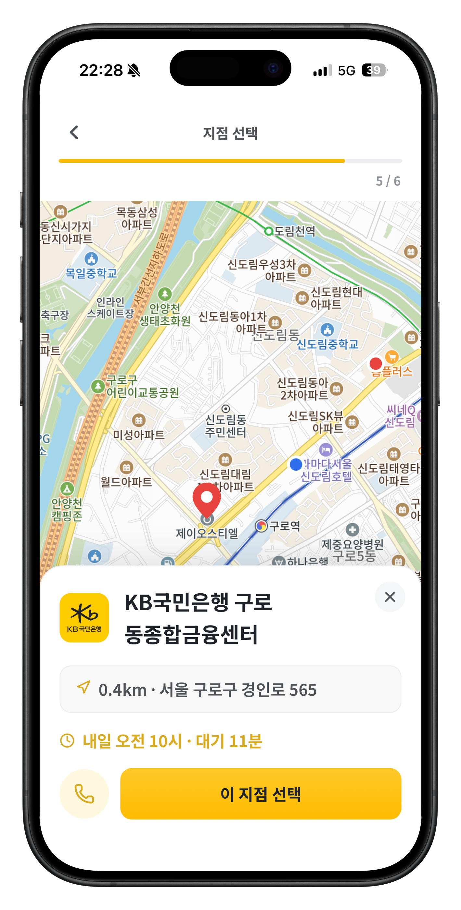
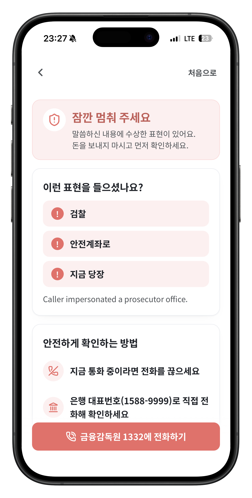
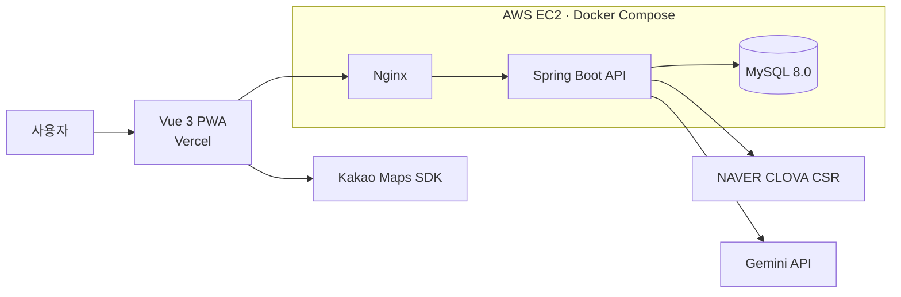

  

[서비스 바로가기](https://eobuba-frontend.vercel.app) · [Frontend](https://github.com/eobuba-official/frontend) · [Backend](https://github.com/eobuba-official/backend)

 

---

## 은행 방문 전 준비를 한 번에

은행 방문은 창구에 도착하기 전부터 어렵습니다. 정확한 업무명을 찾고, 필요한 서류를 챙기고, 해당 업무가 가능한 지점과 방문 시간을 각각 확인해야 하기 때문입니다.

어부바는 이 과정을 하나의 흐름으로 연결합니다. 사용자는 어려운 금융 용어 대신 평소 표현으로 요청하고, 서비스는 확인된 업무를 기준으로 방문 필요 여부와 준비물, 방문할 지점과 예상 대기시간을 안내합니다.

> 어부바는 금융 거래나 방문 예약을 대신하지 않으며, 은행 방문 준비를 돕는 안내 서비스입니다.

## 서비스 흐름

## 주요 화면

<table>
  <tr>
    <th width="33%">01 요청 입력</th>
    <th width="33%">02 인식 결과 확인</th>
    <th width="33%">03 방문 여부 판단</th>
  </tr>
  <tr>
    <td align="center"></td>
    <td align="center"></td>
    <td align="center"></td>
  </tr>
  <tr>
    <td align="center">음성 또는 글자로 평소 표현 그대로 요청합니다.</td>
    <td align="center">인식된 문장을 확인하고 다시 말하거나 직접 수정합니다.</td>
    <td align="center">업무에 따라 방문 필요 여부와 다음 행동을 안내받습니다.</td>
  </tr>
  <tr>
    <th>04 준비물 확인</th>
    <th>05 지점·시간 선택</th>
    <th>06 방문 정보 요약</th>
  </tr>
  <tr>
    <td align="center"></td>
    <td align="center"></td>
    <td align="center"></td>
  </tr>
  <tr>
    <td align="center">상황별 질문을 거쳐 필요한 준비물을 체크합니다.</td>
    <td align="center">거리와 예상 대기시간을 비교해 방문할 지점과 시간을 고릅니다.</td>
    <td align="center">선택한 일정·지점·준비물을 한 화면에서 확인합니다.</td>
  </tr>
</table>

## 핵심 기능

| 기능 | 설명 |
| --- | --- |
| **일상어 기반 요청** | 음성 또는 텍스트로 입력한 표현을 바탕으로 필요한 은행 업무를 찾습니다. |
| **방문 여부 안내** | 확인된 업무가 지점 방문이 필요한지 안내하고, 비대면 처리 가능 여부나 공식 확인 채널을 함께 보여줍니다. |
| **맞춤 준비물 체크** | 업무와 사용자의 상황에 맞는 질문을 거쳐 필요한 준비물을 정리하고 체크할 수 있게 합니다. |
| **지점·시간 추천** | 해당 업무를 처리할 수 있는 지점만 추린 뒤 거리와 예상 대기시간을 함께 고려한 후보를 보여줍니다. |
| **금융사기 신호 경고** | 입력 내용에서 금융사기 의심 신호가 확인되면 일반 업무 안내보다 경고와 공식 채널 확인을 먼저 제공합니다. |

> **안내:** 화면의 지점별 대기시간은 실시간 창구 정보가 아닌 데모용 예상값입니다. 준비물과 업무 가능 여부는 방문 전 은행 공식 채널에서 확인해 주세요.

## 시니어를 고려한 화면 설계

- 한 화면에서 한 가지 핵심 행동에 집중합니다.
- 큰 글씨와 명확한 버튼으로 다음 행동을 안내합니다.
- 음성 입력과 직접 입력을 모두 지원합니다.
- 마지막 화면에서 방문 시간, 지점, 주소와 준비물을 한 번에 확인할 수 있습니다.

## 지도와 금융사기 안전 안내

<table>
  <tr>
    <th width="50%">지도에서 지점 확인</th>
    <th width="50%">금융사기 신호 우선 경고</th>
  </tr>
  <tr>
    <td align="center"></td>
    <td align="center"></td>
  </tr>
  <tr>
    <td align="center">추천 지점의 위치, 거리와 예상 대기시간을 지도에서 확인합니다.</td>
    <td align="center">기관 사칭·안전계좌·비밀 유지·원격 제어·긴급 압박 신호가 감지되면 업무 안내를 멈추고 공식 채널 확인을 먼저 안내합니다.</td>
  </tr>
</table>

## System Architecture

## Tech Stack

| Category | Technologies |
| --- | --- |
| **Frontend** |        |
| **Backend** |      |
| **Data** |  |
| **AI · External** |    |
| **Infrastructure** |      |
| **Test · Quality** |      |

## Team 효도과자

<table>
  <tr>
    <th colspan="2">Front-End</th>
    <th colspan="3">Back-End</th>
  </tr>
  <tr>
    <td align="center" valign="top" width="20%">
       
      <a href="https://github.com/j00112459"><strong>이대주</strong></a> 
      <strong>라우팅 · 공통 UI 상태 관리 · 판단/경고</strong>
    </td>
    <td align="center" valign="top" width="20%">
       
      <a href="https://github.com/J2MIN4452"><strong>이지민</strong></a> 
      <strong>입력/수정 · 준비물 지점/시간 · 접근성</strong>
    </td>
    <td align="center" valign="top" width="20%">
       
      <a href="https://github.com/gnvvoo"><strong>김건우</strong></a> 
      <strong>데이터 · REST API 프론트엔드 연동</strong>
    </td>
    <td align="center" valign="top" width="20%">
       
      <a href="https://github.com/yang5864"><strong>양승환</strong></a> 
      <strong>음성인식 · 업무 분류 금융사기 가드레일</strong>
    </td>
    <td align="center" valign="top" width="20%">
       
      <a href="https://github.com/n03yij"><strong>장지연</strong></a> 
      <strong>방문 판단 · 준비물 지점/시간 추천</strong>
    </td>
  </tr>
</table>
